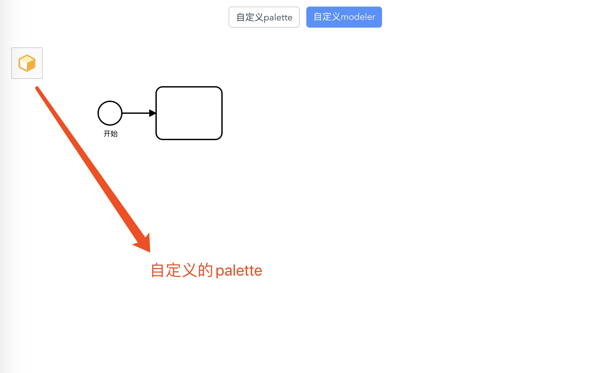

# bpmn-vue-basic

## 项目描述

此项目为以下教材中的教材案例.

- [《自定义Palette篇》](https://github.com/LinDaiDai/bpmn-chinese-document/tree/master/LinDaiDai/全网最详bpmn.js教材-自定义Palette篇.md)🔥🔥

- [《自定义Renderer篇》](https://github.com/LinDaiDai/bpmn-chinese-document/tree/master/LinDaiDai/全网最详bpmn.js教材-自定义Renderer篇.md)🔥🔥🔥🔥

- [《自定义contextPad篇》](https://github.com/LinDaiDai/bpmn-chinese-document/tree/master/LinDaiDai/全网最详bpmn.js教材自定义contextPad篇.md)🔥🔥🔥

- [《编辑、删除节点篇》](https://github.com/LinDaiDai/bpmn-chinese-document/tree/master/LinDaiDai/全网最详bpmn.js教材-编辑、删除节点篇.md)🔥🔥🔥


## 项目截图:




## 如何使用

将项目克隆至本地:

```
git clone git@github.com:LinDaiDai/bpmn-vue-custom.git
```

安装依赖:

```
npm install
```

本地启动项目:

```
npm run serve
```

打包发布至生成环境:

```
npm run build
```

